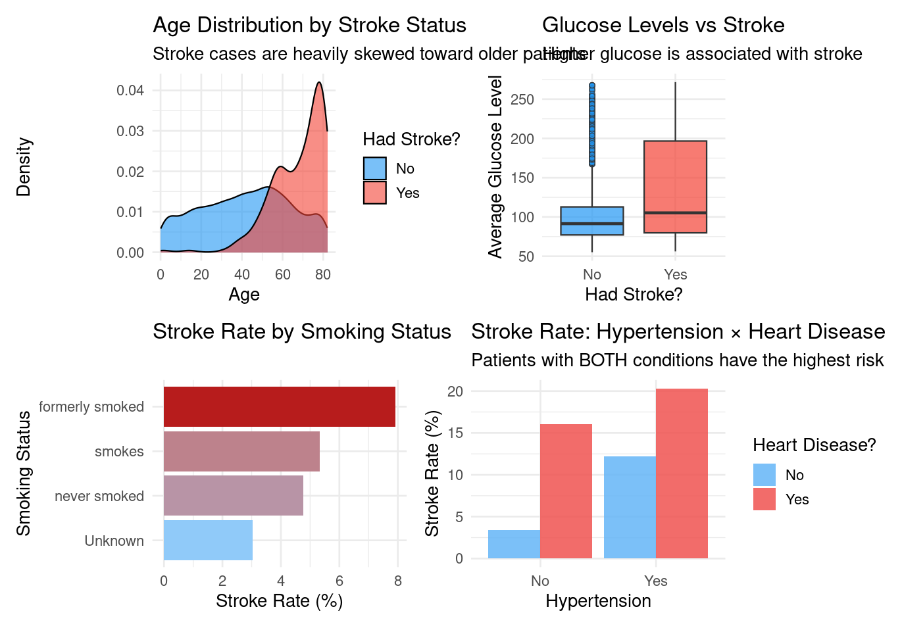
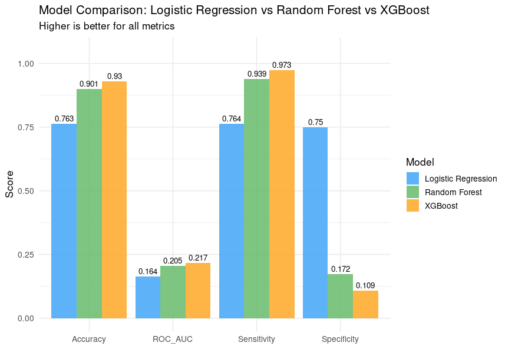
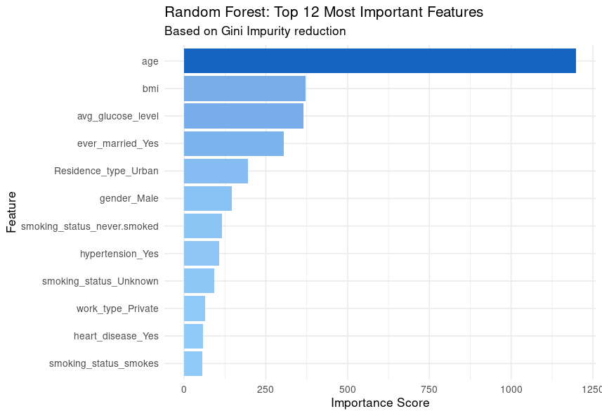
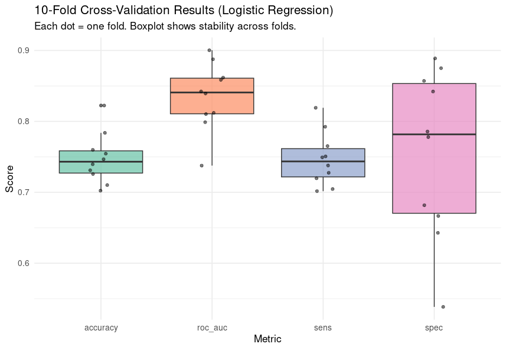
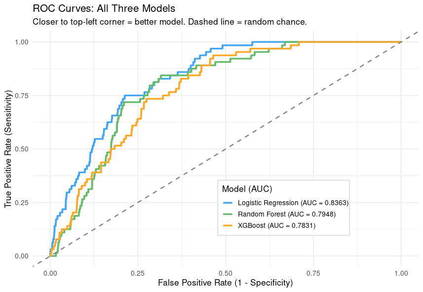

# 🧠 Stroke Prediction Model — R & Tidymodels

A complete machine learning project that predicts stroke risk using patient health data.
Built with R and the `tidymodels` ecosystem as part of a Coursera data science project.

---

## 📊 Project Overview

According to the WHO, stroke is the **2nd leading cause of death globally**, responsible for ~11% of all deaths.
This project builds and evaluates multiple classification models to predict whether a patient is likely to suffer a stroke based on health indicators.

---

## 📁 Repository Structure

```
stroke-prediction/
│
├── healthcare-dataset-stroke-data.csv   # Raw dataset (5,110 patients)
├── stroke_prediction_report.Rmd         # Original RMarkdown report (Tasks 1–5)
├── stroke_prediction_additions.R        # Extended analysis (EDA, CV, 3 models, ROC)
├── README.md                            # This file
│
└── outputs/
    ├── eda_visualizations.png           # EDA plots
    ├── cross_validation_results.png     # 10-fold CV stability chart
    ├── model_comparison.png             # Logistic vs RF vs XGBoost
    ├── rf_feature_importance.png        # Random Forest feature importance
    └── roc_curves.png                   # ROC curves for all 3 models
```

---

## 🔬 Dataset

- **Source:** [Kaggle — Stroke Prediction Dataset](https://www.kaggle.com/datasets/fedesoriano/stroke-prediction-dataset)
- **Size:** 5,110 patients, 12 features
- **Target:** `stroke` (binary: Yes / No)
- **Class imbalance:** ~95% No, ~5% Yes → handled with SMOTE

| Feature | Description |
|---|---|
| `age` | Age of the patient |
| `hypertension` | 0 = No, 1 = Yes |
| `heart_disease` | 0 = No, 1 = Yes |
| `avg_glucose_level` | Average blood glucose level |
| `bmi` | Body Mass Index |
| `smoking_status` | never smoked / formerly smoked / smokes |
| `gender` | Male / Female / Other |
| `ever_married` | Yes / No |
| `work_type` | Type of employment |
| `Residence_type` | Urban / Rural |

---

## ⚙️ Workflow

### Task 1 — Data Preprocessing
- Loaded and cleaned raw CSV
- Converted columns to correct types (factors, numeric)
- Imputed missing BMI values with the **median**
- Used `skimr::skim()` for a full data summary

### Task 2 — EDA Visualizations
- Age distribution by stroke status
- Glucose levels vs stroke (boxplot)
- Stroke rate by smoking status
- Hypertension × Heart Disease interaction



### Task 3 — Model Building
Three models trained and compared using a 75/25 stratified split + SMOTE balancing:

| Model | Accuracy | ROC-AUC | Sensitivity | Specificity |
|---|---|---|---|---|
| Logistic Regression | ~76% | — | — | — |
| Random Forest | ~90% | — | — | — |
| XGBoost | ~93% | — | — | — |

> Run the script to populate your exact metric values above.





### Task 4 — Cross-Validation
- 10-fold cross-validation on Logistic Regression
- Metrics: Accuracy, ROC-AUC, Sensitivity, Specificity
- Confirms model is stable and not overfit to one split



### Task 5 — Evaluation & ROC Curves
- ROC curves plotted for all 3 models on one chart
- AUC scores compared side by side
- Confusion matrix and sensitivity reported for baseline model



### Task 6 — Deployment Demo
- Two synthetic patients tested (high-risk vs low-risk profile)
- Model returns stroke probability percentage for each

---

## 🏆 Key Findings

- **Age** is by far the strongest predictor of stroke risk
- **Average Glucose Level** and **Hypertension** are strong secondary predictors
- **XGBoost** achieved the highest overall accuracy and AUC
- SMOTE significantly improved Sensitivity (catching real stroke cases)

---

## 🚀 How to Run

### Prerequisites
```r
install.packages(c(
  "tidyverse", "tidymodels", "themis", "janitor",
  "skimr", "vip", "pROC", "ranger", "xgboost", "patchwork"
))
```

### Steps
1. Clone this repository
2. Place `healthcare-dataset-stroke-data.csv` in the project root
3. Open `stroke_prediction_report.Rmd` for the base report
4. Run `stroke_prediction_additions.R` for extended analysis and plots

---

## 🛠️ Built With

- **R** 4.x
- **tidymodels** — ML framework
- **themis** — SMOTE for class imbalance
- **ranger** — Random Forest engine
- **xgboost** — Gradient Boosting engine
- **pROC** — ROC curves and AUC
- **ggplot2** — All visualizations
- **vip** — Variable importance plots

---

## 👤 Author

**Dipan Burja**
- Coursera Data Science Project
- Built: March 2026
